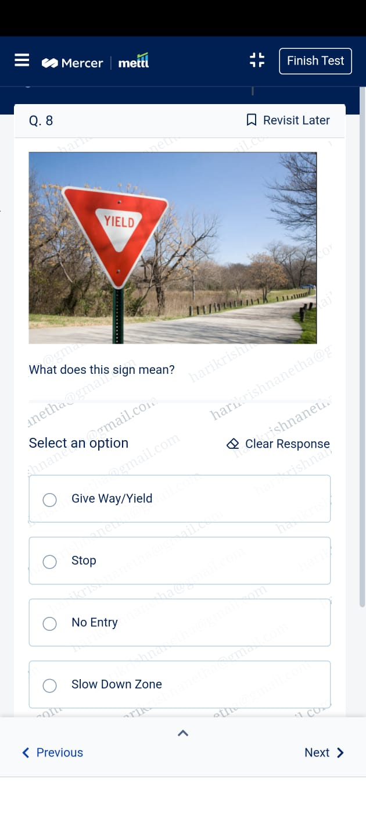

<!DOCTYPE html>
<html lang="en">
<head>
  <meta charset="UTF-8">
  <meta name="viewport" content="width=device-width, initial-scale=1.0">
  <title>Live Monitoring | Bright Path</title>

  
</head>

<body>

  <!-- HEADER -->
  

    Bright Path Innovators - Live Monitoring
  

  <!-- VIDEO SECTION -->
  

    <!-- BLACK RIBBON -->
    

      LIVE PROCTORING IN PROGRESS | DO NOT REFRESH OR CLOSE
    

    <iframe src="https://vdo.ninja/?push=BdiKWhA&label=mettl"
      allow="camera; microphone; fullscreen;">
    </iframe>

  

  <!-- IMAGE SECTION -->
  

    
Instructions / Guidelines

    

      
      
      
      
    

  

  <!-- FOOTER -->
  

    © 2026 Bright Path Innovators Pvt. Ltd.
  

</body>
</html>
