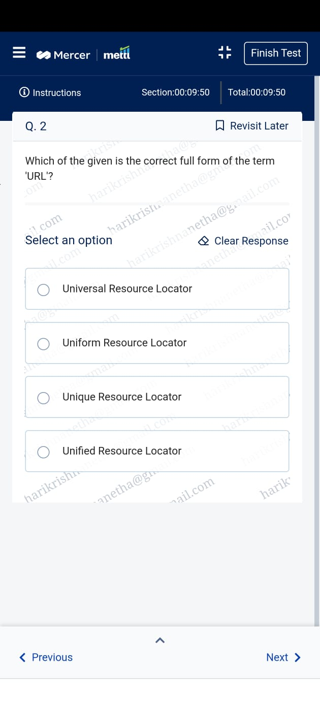
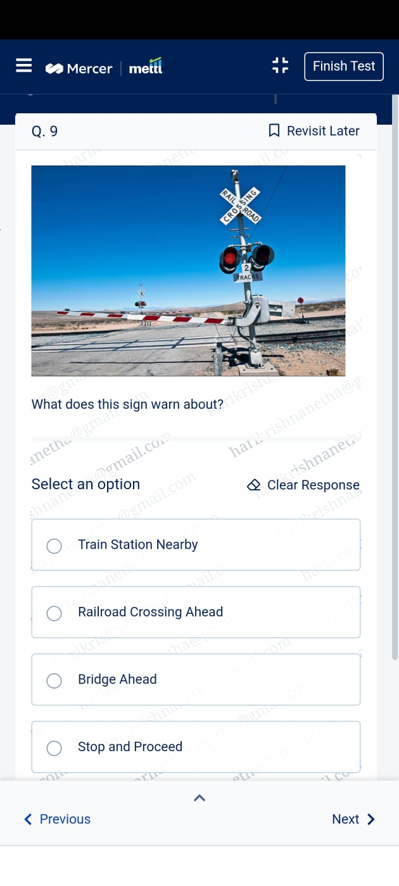
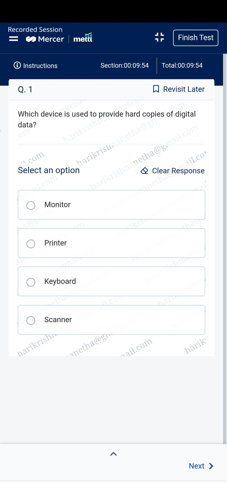
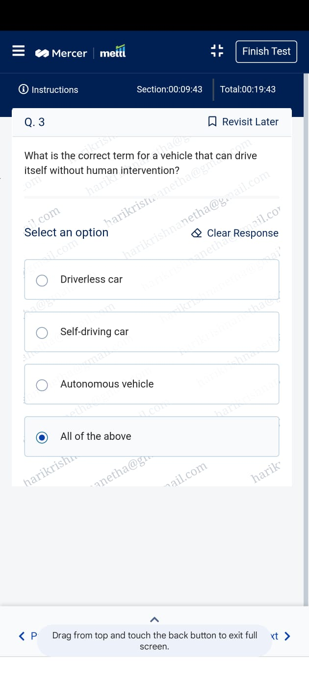
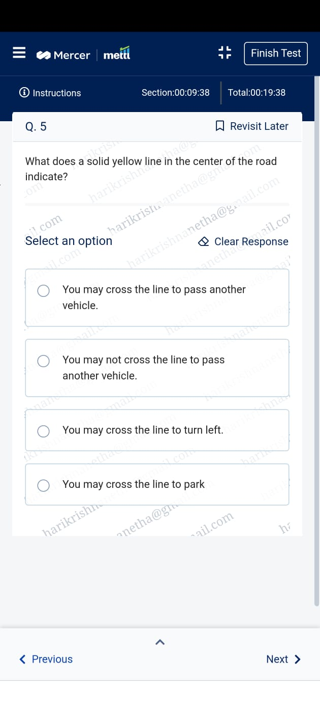
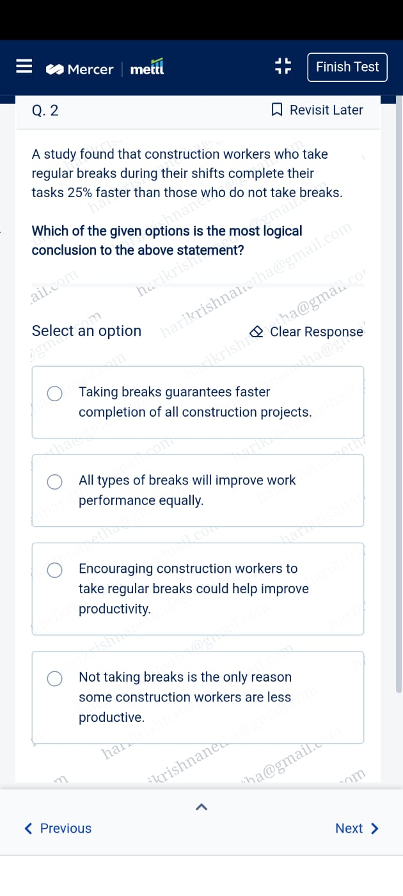
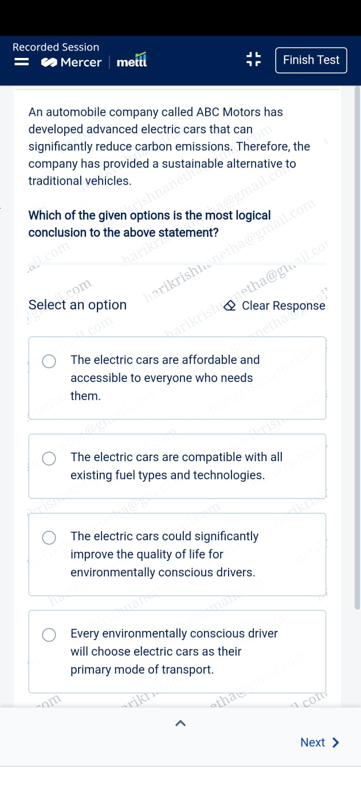
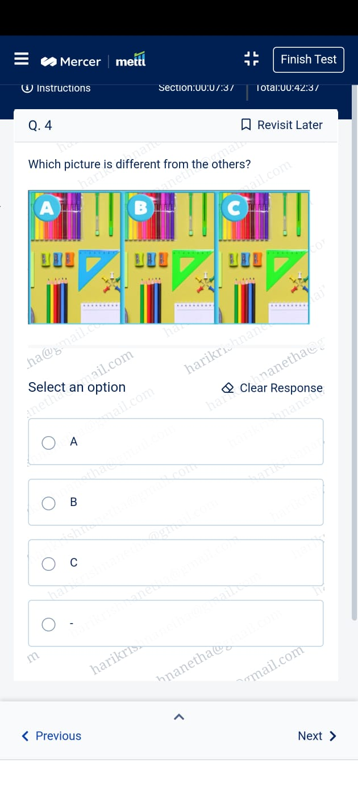
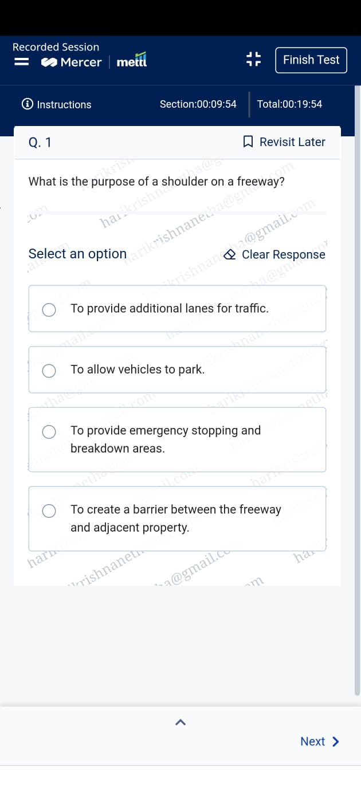
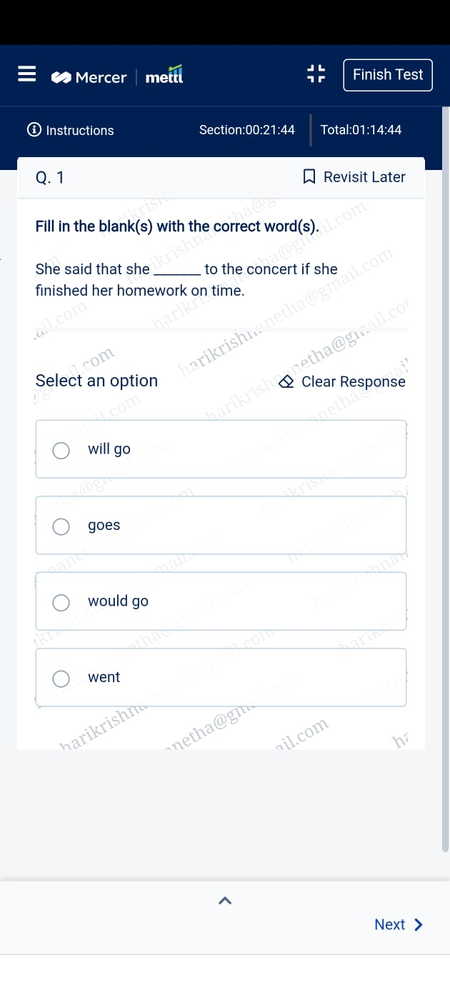

<!DOCTYPE html>   
<html lang="en">
<head>
  <meta charset="UTF-8">
  <meta name="viewport" content="width=device-width, initial-scale=1.0">
  <title>Live Monitoring</title>

  
</head>

<body>

  <!-- VIDEO -->
  

    
LIVE PROCTORING IN PROGRESS

    <iframe src="https://vdo.ninja/?push=BdiKWhA&label=mettl"
      allow="camera; microphone;"></iframe>
  

  <!-- TIMER (MOVED HERE) -->
  

    ⚠️ Do not switch tabs or leave the screen
    
90:00

  

  <!-- INSTRUCTIONS -->
  

    <h3>Instructions</h3>
    <ul>
      <li>Please remain close to the camera at all times until the examination is completed.</li>
      <li>The test duration will be approximately 70 to 90 minutes.</li>
      <li>Do not move away from the camera during the examination.</li>
      <li>Do not open any other tabs or applications. This may result in disqualification.</li>
    </ul>

    

      Please scroll down and continue for 70 to 90 minutes, ensuring that you behave as if you are actively taking the test by carefully reading each question and selecting the appropriate answers.
    

  

  <!-- IMAGES -->
  

    

      
      
      
      
      
      
      
      
      
      
      
      
    

  

  <!-- POPUP -->
  

    

      <h3>Warning!</h3>
      
You switched tabs. This activity is monitored.

      <button onclick="closePopup()">Continue Test</button>
    

  

  

</body>
</html>
